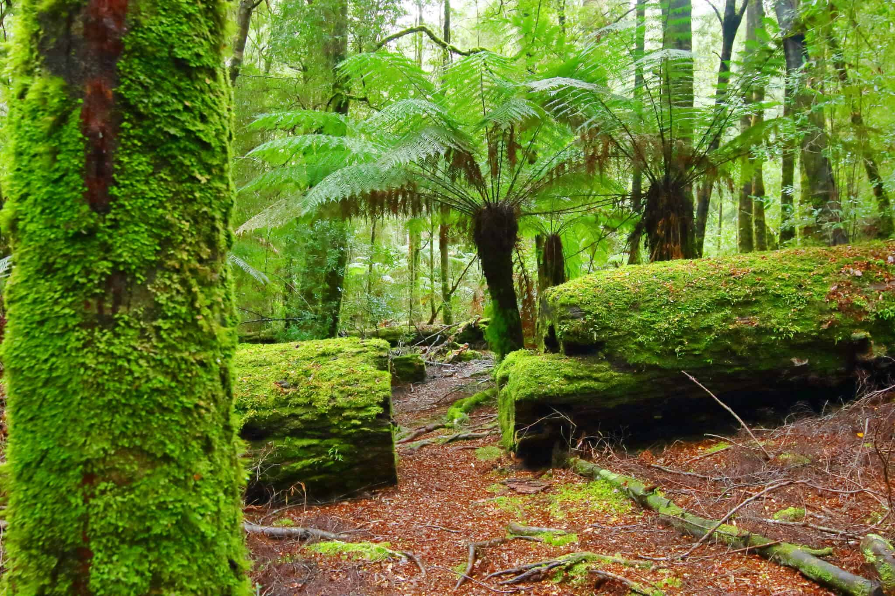

<!DOCTYPE html>
<html>
<body>

<h1>Best Places To Visit In Australia</h1>

Australia is a big place with fascinating and wonderful places to see.With beautiful beaches,great corals and big stones and mountains,let us look at which places are most interesting.There are ranges of places in Australia which have the best views and smooth,wonderful nature. 

In Australia,nature is wonderful and there are many places to explore due to Australia being so big and giant.

These are the best places to visit in Australia with lots of fun!

<h1>1.The Tarkine Rainforest,TAS<h1>

The Tarkine rainforest is in Tasmania and it is a national park.It is very lush and lots of green trees and plants.This rainforest is home to more than 60 species of rare,special and sadly,endangered species.Also the world's only insects fossils were found in the Tarkine Rainforest,found in sediments of real origin.

2. Sydney, New South Wales\
Iconic Sights: The Sydney Opera House and Sydney Harbour Bridge
Activities: Take a walk along the Bondi to Coogee Coastal Walk, visit Taronga Zoo, and enjoy a day at Manly Beach.

3.The Great Barrier Reef,Queensland
Snorkeling & Diving: Explore the world's largest coral reef system teeming with marine life.
Whitsunday Islands: White sandy beaches and crystal-clear waters.
<img src="images.jpg" width="300" height="200"

